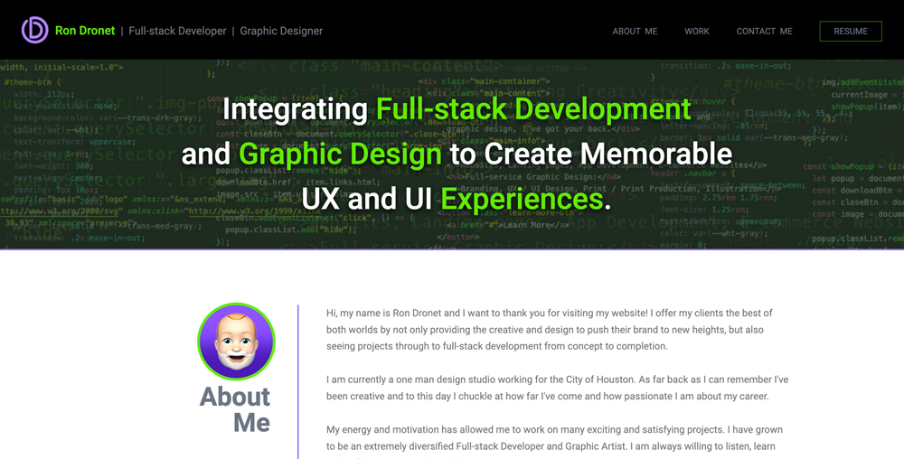

## Dronet-DevDesign / Full-stack Development & Graphic Design:
Ron Dronet Portfolio Website

## Purpose:
DronetDevDesign offers Full-stack Development and Graphic Design in one place. I offer my clients the best of both worlds by not only providing the creative and design to push their brand to new heights, but also seeing projects through to full-stack development from concept to completion.

 

     

 

## Viewable Responsive Screen Sizes:
* Desktop: 1800px
* Media Query Sizes:
  - 980px (Desktop - laptops)
  - 768px (Laptop - tablets)
  - 575px (Small devices - large cell phones)

## Website Link:
https://dronetdevdesign.github.io/Dronet-DevDesign/

## This Website Created Using:
* HTML
* CSS

## Graphic Software Used:
* Adobe Photoshop:
    
    Note: The HERO section background was created using screenshots of my own code then opened up in Photoshop and cropped. Layers were then created to overlap the images. Filters were applied to achieve the dark transparent mood of the background to integrate well with the color palette chosen for the website.

## Services:
### Full-stack Development:
* Front-end Web Development:
    HTML, CSS, JavaScript and React
        
* Back-end Development:
    NodeJS, ExpressJS, MongoDB, and SQL

### Graphic Design and Illustration:
* Adobe Software Programs:
    Photoshop, Illustrator, InDesign, AfterEffects and PremierPro
      
* Other Graphic Software:
    Affinity Designer and Blender3D

* Miscrosoft:
    Word, Publisher, PowerPoint and Excel

## Contribution:
Ron Dronet - Full-stack Developer and Graphic Designer